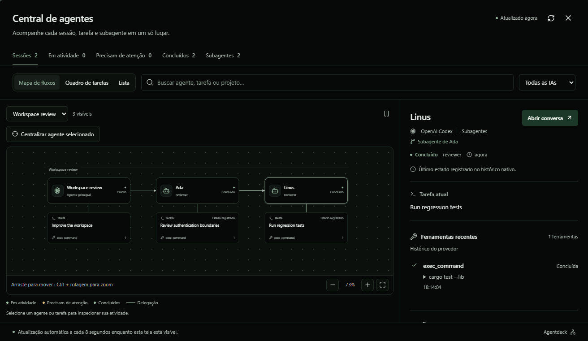
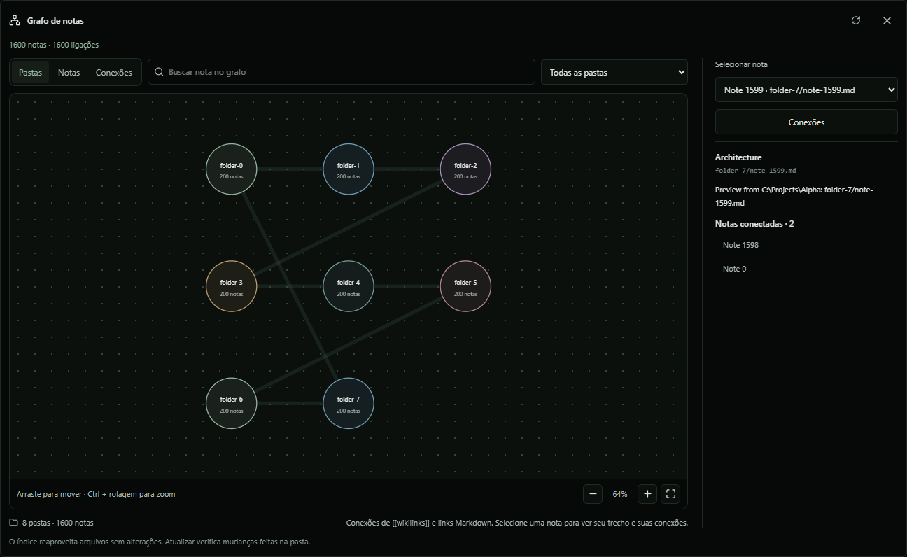

# Agent Deck

A desktop workspace for running coding agents, understanding their tasks and exploring project knowledge in one place.

Agent Deck brings official Codex, Claude Code and Gemini CLIs into a Windows-first Tauri workbench with chat, terminals, an editor, Git worktrees, diffs and local memory. Authentication stays with each provider's official client.

## New in 0.5.0

- **Expandable knowledge graph:** folder clusters, note search, folder filters and one- to three-hop connections. Pan, zoom, fit and bound visible nodes to keep dense graphs readable.
- **Agent flow map:** floating agent/task cards organized by session and delegation, animated connectors, a detailed inspector and a task board. Pause animations or use system reduced motion.
- **Reproducible checkout:** pinned lockfiles, English documentation, hygiene checks and Windows CI. Personal state, credentials, historical transcripts and build output stay outside version control.

<details>
<summary>Preview the agent map and expanded knowledge graph</summary>

Screenshots use synthetic test data. The interface shown is Portuguese; English and Spanish are also available.




</details>

## Get started

Install Git, Node.js 22.12+, Rust stable, Visual Studio C++ build tools and WebView2. See the [setup guide](docs/setup.md) for prerequisites and troubleshooting.

```sh
git clone https://github.com/arthurhpabreu/agentdeck.git
cd agentdeck
corepack pnpm install --frozen-lockfile
corepack pnpm tauri dev
```

The repository is private; cloning requires access. No API key, personal path, database export or `.env` file is needed to build the app. Install a supported official agent CLI and complete its interactive sign-in, then open a project and create a session.

## Workspace

| Feature | Behavior |
| --- | --- |
| Agents | Flow map, session list, task board, tools and provider-reported subagent relationships. |
| Conversations | Claude/Codex chat, follow-up input, attachments, model selection, planning and native terminals. Gemini uses its terminal. |
| Git | Independent worktrees, status, diffs, staging and conflict resolution. |
| Knowledge | Local Markdown/Obsidian sources, searchable note graph and connected-note previews. |
| Memory | Global/project SQLite memory, bounded retrieval, history, curation and Markdown export. |
| Providers | CLI detection, model catalogues, reported account usage and update controls. |
| Accessibility | Keyboard controls, English/Portuguese/Spanish, light/dark themes and reduced motion. |

## Complex graphs

In **Knowledge → Documents**, choose a source and click **Expand graph**. Use **Folders** for an overview, select a folder or search by title/path, then choose **Connections** to isolate a note's neighborhood. Drag to pan, use Ctrl + scroll or zoom buttons, and use **Fit graph** to reset. With the canvas focused, arrow keys pan, `+`/`-` zoom and `0` fits.

The index supports up to 3,000 notes, 16 MB of text and 256 KB per note. Compact graphs show up to 120 notes; expanded note views show up to 150, 350 or 700 matches. Folder counts and note selection cover the complete indexed source. Graph browsing does not call a model.

In **Agents**, switch between **Flow map**, **Task board** and **List**. Filter by provider, status, text or session. Click an agent or task to inspect its tools and conversation. Connectors animate during reported active execution; native transcript states are labeled as recorded history. Missing telemetry remains explicit.

When a CLI update is confirmed, a badge in the title bar shows the number of available updates. Click it to open **Settings → System → Agent updates** and inspect installed/latest versions. Updates remain an explicit action.

## Development

```sh
corepack pnpm dev           # Browser UI on port 1420
corepack pnpm dev:worktree  # Isolated desktop development
corepack pnpm build
corepack pnpm check:i18n
corepack pnpm check:repo
corepack pnpm test:ui
cargo test --manifest-path src-tauri/Cargo.toml --lib
```

RTK is optional for output economy; development and CI do not require it. Browser tests mock native commands and never run account tasks. [Testing details](docs/testing.md).

Build Windows NSIS/MSI installers with `powershell -NoProfile -File scripts/build-windows.ps1`. Artifacts go to `src-tauri/target/release/bundle/` and are not committed. Tag releases create a draft for review.

## Data and permissions

Vault files remain in their original folders. Relevant excerpts can enter a task's provider context within the configured budget. Preferences, histories and SQLite memory persist in local application storage independently of the checkout.

Code mode enables full machine access by default and can be disabled per conversation; Plan stays read only. Provider credentials remain in native integration. [Security and local data](SECURITY.md).

## Documentation

- [Setup](docs/setup.md)
- [Architecture](docs/architecture.md)
- [Testing](docs/testing.md)
- [Validation evidence](docs/validation.md)
- [Contributing](CONTRIBUTING.md)
- [Changelog](CHANGELOG.md)

## License

Apache 2.0. See [LICENSE](LICENSE) for the complete terms and retained copyright notice. Repository visibility does not change the license.
