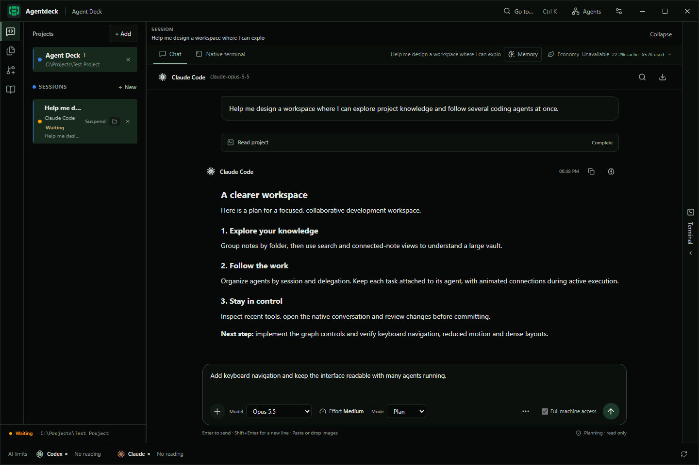

# Agent Deck



A desktop workspace for running coding agents, understanding their tasks and exploring project knowledge in one place.

Agent Deck brings official Codex, Claude Code and Gemini CLIs into a Windows-first Tauri workbench with chat, terminals, an editor, Git worktrees, diffs and local memory. Authentication stays with each provider's official client.

## New in 0.6.3

- **Composer layout fix:** model, effort, mode and access settings have their own row. Attachments, context settings and response actions stay aligned below, including while context compaction is running.

Install 0.6.3 over your current version using the same installer type. See the [changelog](CHANGELOG.md) for release details.

## Introduced in 0.6.2

- **Automatic context compaction:** Claude Code and Codex chats compact before the next request after 20 prompts or approximately 64,000 context tokens. Adjust either limit or turn compaction off in **Conversation context**, in the composer's action row.
- **Long conversation performance:** the chat displays 80 messages at a time and saves changed messages asynchronously. Earlier messages remain available through history navigation, search and complete Markdown export.
- **Safer continuation:** compaction keeps the provider conversation and waits for its completion. Failed compaction preserves your pending request; repeated reasoning events no longer fill the activity panel.

Existing local chats migrate automatically to the new local history archive. See [context and history behavior](docs/context-compaction.md) and the [changelog](CHANGELOG.md).

## Introduced in 0.6.1

- **Application update checks:** Agent Deck checks stable official releases when it opens. Click the version badge to download the installer, then choose **Install update** in **Settings → System**. Downloads are verified against the release checksum, and the updater keeps the installed package type (`.exe` or `.msi`).
- **Session names you control:** click the pencil in the session list or conversation header. Save with Enter or cancel with Escape. Your chosen name stays when sending messages, reopening the app or recovering sessions.
- **Memory retrieval for large requests:** long prompts now use a bounded search sample instead of failing with `Query exceeds limit`. The agent still receives your full request; memory and global vault excerpts stay within your context budget.


## Introduced in 0.6.0

- **Commands and skills in every composer:** type `/`, type `$` for Codex skills, or open the searchable picker. Existing user/project definitions and supported plugin metadata are discovered automatically.
- **Provider-aware execution:** session controls update the chat settings, Claude supports its reported non-interactive commands, and terminal-only commands open the native CLI with the current session binding.
- **Personal Use License:** free personal use and private modifications; resale, commercial use and redistribution require Arthur Abreu's written permission. Earlier release permissions remain valid.

## Workspace highlights

- **Expandable knowledge graph:** folder clusters, note search, folder filters and one- to three-hop connections. Pan, zoom, fit and bound visible nodes to keep dense graphs readable.
- **Agent flow map:** floating agent/task cards organized by session and delegation, animated connectors, a detailed inspector and a task board. Pause animations or use system reduced motion.
- **Reproducible checkout:** pinned lockfiles, English documentation, hygiene checks and Windows CI. Personal state, credentials, historical transcripts and build output stay outside version control.

<details>
<summary>Preview the agent map and expanded knowledge graph</summary>

Screenshots use synthetic test data. The interface shown is Portuguese; English and Spanish are also available.


</details>

## Get started

For the packaged Windows app, download the `.exe` or `.msi` from [Releases](https://github.com/arthurhpabreu/agentdeck/releases). Both install the same app; use the `.exe` for the usual interactive setup. Release assets include SHA-256 checksums. Current installers are unsigned and publicly available.

Install Git, Node.js 22.12+, Rust stable, Visual Studio C++ build tools and WebView2. See the [setup guide](docs/setup.md) for prerequisites and troubleshooting.

```sh
git clone https://github.com/arthurhpabreu/agentdeck.git
cd agentdeck
corepack pnpm install --frozen-lockfile
corepack pnpm tauri dev
```

The repository is public and can be cloned without requesting access. No API key, personal path, database export or `.env` file is needed to build the app. Install a supported official agent CLI and complete its interactive sign-in, then open a project and create a session.

## Workspace

| Feature | Behavior |
| --- | --- |
| Agents | Flow map, session list, task board, tools and provider-reported subagent relationships. |
| Conversations | Claude/Codex chat, follow-up input, attachments, model selection, planning and native terminals. Gemini uses its terminal. |
| Commands and skills | Searchable suggestions in chat, native startup and follow-up inputs; metadata from installed providers and local definitions. |
| Git | Independent worktrees, status, diffs, staging and conflict resolution. |
| Knowledge | Local Markdown/Obsidian sources, searchable note graph and connected-note previews. |
| Memory | Global/project SQLite memory, bounded retrieval, history, curation and Markdown export. |
| Providers | CLI detection, model catalogues, reported account usage and update controls. |
| Accessibility | Keyboard controls, English/Portuguese/Spanish, light/dark themes and reduced motion. |

## Complex graphs

In **Knowledge → Documents**, choose a source and click **Expand graph**. Use **Folders** for an overview, select a folder or search by title/path, then choose **Connections** to isolate a note's neighborhood. Drag to pan, use Ctrl + scroll or zoom buttons, and use **Fit graph** to reset. With the canvas focused, arrow keys pan, `+`/`-` zoom and `0` fits.

The index supports up to 3,000 notes, 16 MB of text and 256 KB per note. Compact graphs show up to 120 notes; expanded note views show up to 150, 350 or 700 matches. Folder counts and note selection cover the complete indexed source. Graph browsing does not call a model.

In **Agents**, switch between **Flow map**, **Task board** and **List**. Filter by provider, status, text or session. Click an agent or task to inspect its tools and conversation. Connectors animate during reported active execution; native transcript states are labeled as recorded history. Missing telemetry remains explicit.

When a CLI update is confirmed, a badge in the title bar shows the number of available updates. Click it to open **Settings → System → Agent updates** and inspect installed/latest versions. Updates remain an explicit action.

## Development

```sh
corepack pnpm dev           # Browser UI on port 1420
corepack pnpm dev:worktree  # Isolated desktop development
corepack pnpm build
corepack pnpm check:i18n
corepack pnpm check:repo
corepack pnpm test:ui
cargo test --manifest-path src-tauri/Cargo.toml --lib
```

RTK is optional for output economy; development and CI do not require it. Browser tests mock native commands and never run account tasks. [Testing details](docs/testing.md).

Build Windows NSIS/MSI installers with `powershell -NoProfile -File scripts/build-windows.ps1`. Artifacts go to `src-tauri/target/release/bundle/` and are not committed. Tag releases create a draft for review.

## Data and permissions

Vault files remain in their original folders. Relevant excerpts can enter a task's provider context within the configured budget. Preferences, histories and SQLite memory persist in local application storage independently of the checkout.

Code mode enables full machine access by default and can be disabled per conversation; Plan stays read only. Provider credentials remain in native integration. [Security and local data](SECURITY.md).

## Documentation

- [Setup](docs/setup.md)
- [Architecture](docs/architecture.md)
- [Testing](docs/testing.md)
- [Commands and skills](docs/commands-and-skills.md)
- [Licensing](docs/licensing.md)
- [Validation evidence](docs/validation.md)
- [Contributing](CONTRIBUTING.md)
- [Changelog](CHANGELOG.md)

## License

Copyright © 2026 Arthur Abreu. Starting with 0.6.0, Agent Deck uses the
[Personal Use License](LICENSE). You may use, study and modify the app privately
for personal, non-commercial purposes. Resale, commercial use and redistribution
require prior written permission. You may share links to the official downloads.

The public repository makes the source available; this is not an open-source
license. Version 0.5.0 retains its original Apache 2.0 permissions. Third-party
dependencies retain their own licenses. See [licensing details](docs/licensing.md).
